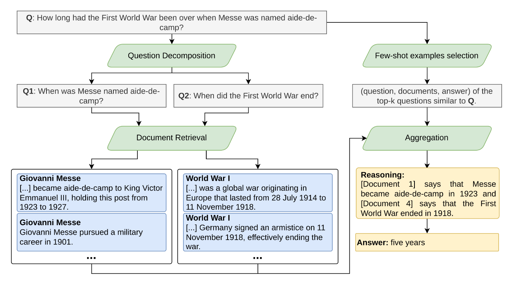

<h1 align="center">Imersão de Alura com Google em IA</h1>

 Código que demonstra como integrar a API da Gemini com um modelo RAG para obter informações externas e melhorar o desempenho dos LLMs. A aplicação desenvolvida foi inspirada no artigo do Visconde, que pode ser acessado através do seguinte link: [https://arxiv.org/pdf/2212.09656]. 

## 💻 Tecnologias 

Este projeto foi realizado utilizando as seguintes tecnologias:

- Python 🐍
- Git y Github

## 🖥️ Modelo para o Processamento de Linguagem Natural

- Gemini (models/gemini-1.5-pro-latest)
- RAG    (RAG-Naive)

## 🎯 Objetivo

Desenvolver um sistema que integre as tecnologias da Gemini com o RAG para responder a perguntas propostas em diversos documentos externos. Para isso, o RAG nos ajuda a estruturar as etapas de recuperação, geração e agregação.
